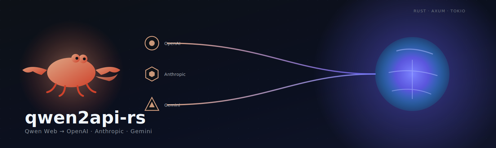
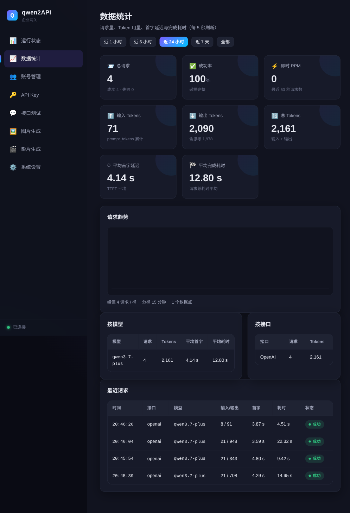
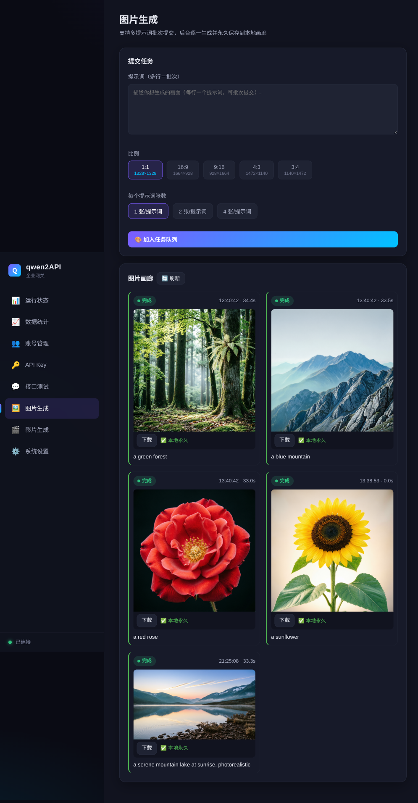
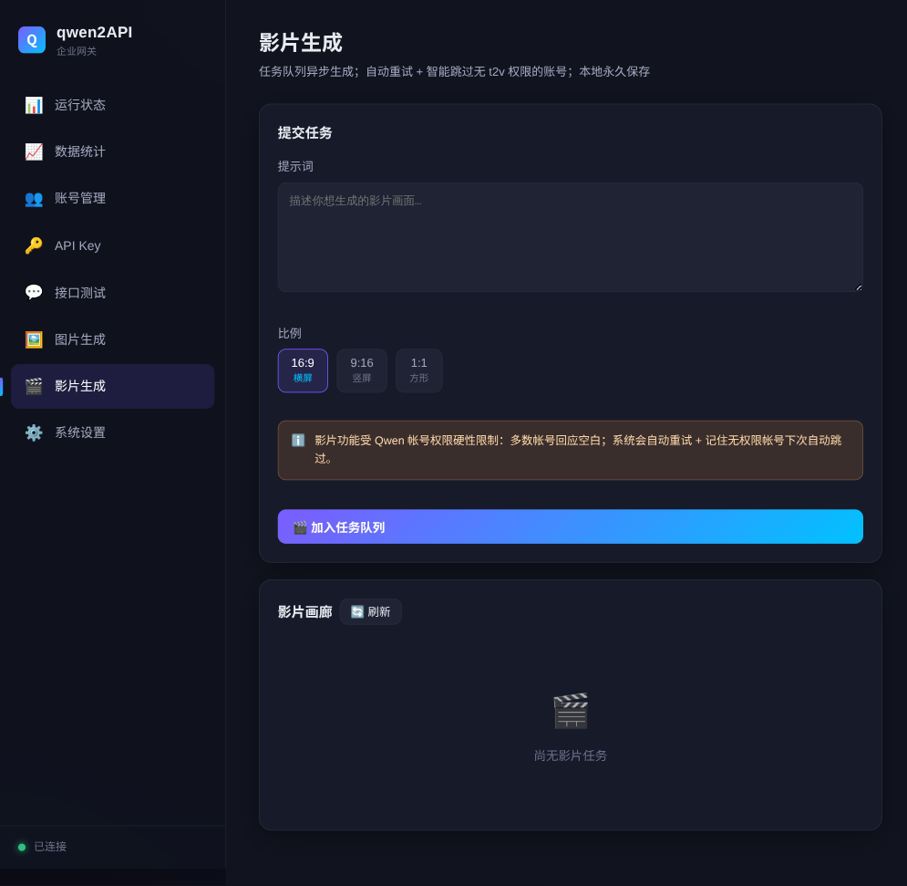

<div align="center">



# qwen2api-rs

A self-hosted gateway that exposes Qwen (Tongyi Qianwen) Web capabilities as **OpenAI / Anthropic Claude / Gemini** compatible APIs.

[](LICENSE)
[](https://www.rust-lang.org)
[](https://github.com/tokio-rs/axum)
[](https://tokio.rs)
[](https://www.docker.com)

**Language**: **English** · [繁體中文](README.zh-TW.md)

</div>

> 💡 **Just want to try the service without deploying it yourself?** I run a public instance you can hit directly → **<https://x.com/i/status/2063271049199046672>**
>
> (This repo is for people who want to self-host. If you only want to use it, the link above is enough.)

> **This project is a Rust backend + vanilla frontend rewrite of [YuJunZhiXue/qwen2API](https://github.com/YuJunZhiXue/qwen2API) (Python + React).** I am not the original author — credit for the protocol analysis and overall design goes to upstream. See [`dev/UPSTREAM.md`](dev/UPSTREAM.md) for the tracked upstream version and sync process.

- **Backend**: Rust (`axum` + `tokio` + `reqwest` + `serde`), a single static binary — low memory, high concurrency.
- **Frontend**: Three plain `HTML + CSS + JS` files (`web/`) — zero framework, zero build step, works offline.
- **Protocols**: OpenAI / Anthropic / Gemini API surfaces all served from the same binary.

---

## Features

- ✅ OpenAI Chat Completions (`/v1/chat/completions`) — streaming + non-streaming
- ✅ OpenAI Responses (`/v1/responses`) — typed SSE events
- ✅ Anthropic Messages (`/v1/messages`, `/anthropic/v1/messages`) — streaming + non-streaming + `count_tokens`
- ✅ Gemini `generateContent` / `streamGenerateContent`
- ✅ OpenAI Images (`/v1/images/generations`) — drives Qwen image generation
- ✅ OpenAI Embeddings (placeholder, deterministic vectors)
- ✅ File upload (`/v1/files`) + conversation attachments (auto Aliyun OSS V4 upload / inline small text)
- ✅ Tool / function calling: tool definitions injected into prompt + `tool_call` parsed from output (Qwen Web has no native tool support)
- ✅ Reasoning mode streaming, **usage uses real upstream token counts**
- ✅ Account pool: 4-layer concurrency control, least-load selection, rate-limit exponential backoff, cross-account retry
- ✅ chat_id pre-warming pool (avoids the 0.5~6s `/chats/new` handshake; with coverage cap to protect tens of thousands of accounts)
- ✅ Admin WebUI: runtime status, account management, API keys, endpoint testing, image generation, system settings
- ✅ `/healthz`, `/readyz` probes

## Screenshots

<table>
  <tr>
    <td align="center" width="50%">
      
      <sub><b>Stats</b> · requests / tokens / TTFT buckets, split by model + endpoint</sub>
    </td>
    <td align="center" width="50%">
      
      <sub><b>Image generation</b> · batch submit, aspect ratio toggle, local permanent storage</sub>
    </td>
  </tr>
  <tr>
    <td align="center" colspan="2">
      
      <br/><sub><b>Video generation</b> · async task queue + auto retry + smart skip of accounts without t2v permission</sub>
    </td>
  </tr>
</table>

## Quick start

Requirements: Rust 1.80+ (tested up to 1.93).

```bash
cp .env.example .env          # set ADMIN_KEY, PORT, etc.
mkdir -p data
# Add accounts: data/accounts.json = [{"email","token", ...}, ...]
#   token = raw token value from localStorage after logging into chat.qwen.ai
#   See dev/accounts.example.json for the template
cargo run --release
```

After startup:
- WebUI: `http://127.0.0.1:7860/` (paste `ADMIN_KEY` or any API key on the Settings page as the session key)
- API Base: `http://127.0.0.1:7860`

Call example (OpenAI compatible):

```bash
curl http://127.0.0.1:7860/v1/chat/completions \
  -H "Authorization: Bearer <your API key or ADMIN_KEY>" \
  -H "Content-Type: application/json" \
  -d '{"model":"gpt-4o","messages":[{"role":"user","content":"hello"}],"stream":true}'
```

Anthropic compatible:

```bash
curl http://127.0.0.1:7860/v1/messages \
  -H "x-api-key: <your API key or ADMIN_KEY>" \
  -H "anthropic-version: 2023-06-01" \
  -H "Content-Type: application/json" \
  -d '{"model":"claude-3-5-sonnet-20241022","max_tokens":1024,"messages":[{"role":"user","content":"hello"}]}'
```

The `model` field accepts any OpenAI / Claude / Gemini model name (auto-mapped to Qwen; unknown names fall back to `DEFAULT_MODEL`), or you can pass Qwen names directly such as `qwen3.7-plus`, `qwen3.7-plus-thinking`, etc. (`/v1/models` lists all of them).

## Deployment

Either option works (single static binary, rustls — no system OpenSSL needed).

### Docker (recommended, especially when migrating from the Python version)

Same docker-compose workflow as the original project; image is ~145MB (debian-slim base, much smaller than the original Python version with camoufox; can be slimmed further with distroless / musl).

```bash
# data/ can be reused as-is from the original version (holds accounts.json etc.)
mkdir -p data
vim docker-compose.yml      # set ADMIN_KEY etc.
docker compose up -d --build
docker compose logs -f
```

- Data persistence: `./data` is mounted to `/app/data` in the container.
- Built-in `HEALTHCHECK` (hits `/healthz`).
- Update: `git pull && docker compose up -d --build`.

### Binary (lightest, single host / VPS)

```bash
cargo build --release          # produces target/release/qwen2api-rs
cp .env.example .env && vim .env
mkdir -p data                  # put accounts.json here
WEB_DIR=web ./target/release/qwen2api-rs
```

Recommended to run under systemd (`/etc/systemd/system/qwen2api-rs.service`):

```ini
[Unit]
Description=qwen2api-rs gateway
After=network.target

[Service]
WorkingDirectory=/opt/qwen2api-rs
EnvironmentFile=/opt/qwen2api-rs/.env
ExecStart=/opt/qwen2api-rs/qwen2api-rs
Restart=always

[Install]
WantedBy=multi-user.target
```

> **Docker vs Binary trade-off**: Docker = reproducible, isolated, portable across distros, same workflow as the original, easy update / restart. Binary = fastest startup, smallest footprint, no docker needed — but you have to wire systemd yourself and watch out for glibc versions across hosts (or build static with musl).

## Environment variables

Full list in [`.env.example`](.env.example) (20+ entries covering rate-limit avoidance / account pool / context handling). Variable names are compatible with the original Python version, so you can point it at the same `data/`.

| Variable | Purpose | Default |
|---|---|---|
| `PORT` | Service port | `7860` |
| `ADMIN_KEY` | Admin panel key | `change-me-now` |
| `MAX_INFLIGHT_PER_ACCOUNT` | Concurrent in-flight requests per account | `2` |
| `MAX_RETRIES` | Cross-account retry count | `3` |
| `ACCOUNT_MIN_INTERVAL_MS` | Min interval between same-account requests (rate-limit avoidance) | `3000` |
| `CHAT_ID_PREWARM_TARGET_PER_ACCOUNT` | Pre-warm pool target chat_ids per account | `5` |
| `DEFAULT_MODEL` | Fallback for unknown downstream models | `qwen3.7-plus` |
| `DATA_DIR` | Data directory | `./data` |

## Authentication

- Downstream requests: `Authorization: Bearer <key>`, `x-api-key`, or `?key=`.
- If `data/api_keys.json` has keys configured, requests must use `ADMIN_KEY` / a created key; otherwise any key is allowed.
- Admin endpoints `/api/admin/*`: `Bearer` must equal `ADMIN_KEY` or a created key.

## Architecture

Tech stack and Python→Rust module mapping in [`dev/ARCHITECTURE.md`](dev/ARCHITECTURE.md); the captured upstream protocol (including SSE format) in [`dev/PROTOCOL.md`](dev/PROTOCOL.md).

```
src/
  main.rs            entry / routing
  config.rs state.rs db.rs error.rs util.rs auth.rs
  account/           account pool (account.rs / pool.rs)
  upstream/          upstream transport (client / payload / sse / executor / chat_id_pool)
  request/           standard request building (model_modes / prompt_builder / client_profiles / model_catalog)
  toolcall/          tool calling (inject + parse + name obfuscation)
  execution/         orchestration + stream translation (translator / presenter / formatters)
  context/           attachments / OSS V4 upload / local file store
  api/               per-protocol endpoints (openai / anthropic / gemini / responses / images / videos / files / embeddings / admin / probes)
  stats.rs           SQLite stats subsystem
  media.rs           media task queue (images / videos)
web/                 plain frontend (index.html / app.js / style.css)
dev/                 developer notes (upstream tracking, architecture, protocol captures, deployment)
```

## Intentional differences from the original ([YuJunZhiXue/qwen2API](https://github.com/YuJunZhiXue/qwen2API))

1. **Removed browser-based auto-registration** (camoufox / Playwright + temp mail) → manual token paste only; additionally provides pure HTTP `chat.qwen.ai` signin + auto refresh worker.
2. **`usage` now uses real upstream token counts** (the original estimated by character count).
3. **Default flagship model** updated to `qwen3.7-plus`.
4. **Tool calling** uses a single stable text format (`<tool_call>{json}</tool_call>`) for injection + parsing (brace-balanced, no regex pitfalls).
5. **Media subsystem**: images / videos refactored into an async task queue (SQLite-persisted) + auto retry + smart skip of accounts without t2v permission.
6. **Observability**: new `stats.rs` panel (request volume / tokens / TTFT / per-model + per-endpoint breakdown).

Details in [`dev/UPSTREAM.md`](dev/UPSTREAM.md).

## Credits

- Upstream original project [**YuJunZhiXue/qwen2API**](https://github.com/YuJunZhiXue/qwen2API) — the protocol analysis, multi-protocol translation approach, and the whole account pool / rate-limit design all originate from there.
- Qwen / Tongyi Qianwen by Alibaba — model and web interface.

## License

[MIT License](LICENSE)

> For learning and self-hosting research only. Qwen is a trademark of Alibaba; usage must comply with their Terms of Service. This project makes no guarantee about the stability of the upstream web interface behavior.
